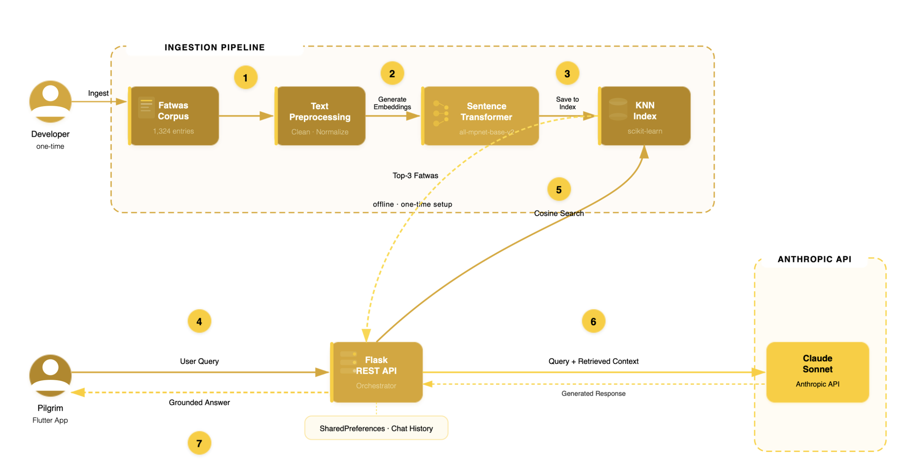
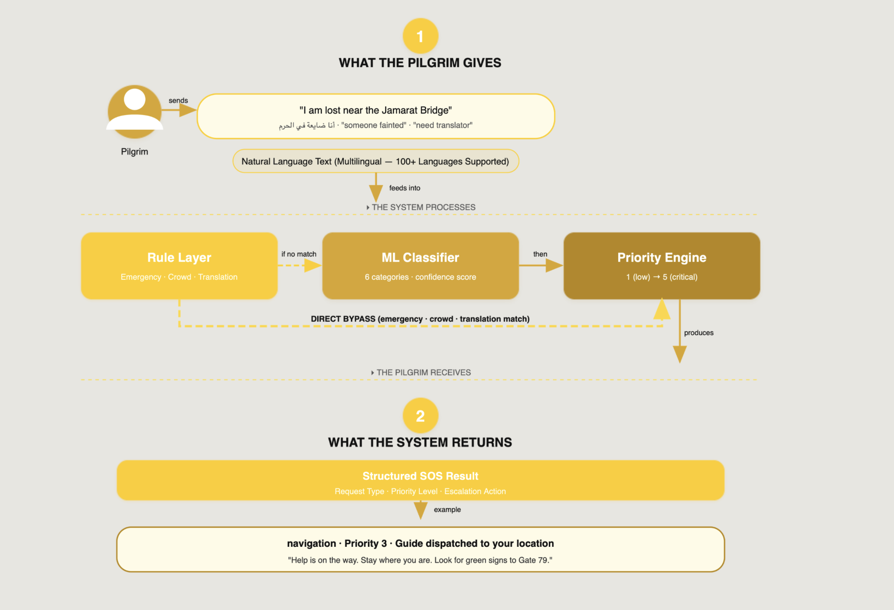

# Noor Al-Tariq

Noor Al-Tariq is an AI companion app for Hajj and Umrah pilgrims, built to help guide and support them throughout their journey.

## What it does

- Answers pilgrim questions using a RAG/LLM-powered assistant (88% answer relevancy)
- Detects emergency/SOS situations with high accuracy (99.5% SOS classifier accuracy)
- Supports 50+ languages for translation
- Provides separate experiences for pilgrims and volunteers

## Demo

[Watch the demo](./demo1.mp4)

## Architecture

**RAG pipeline** — how pilgrim questions are answered using retrieval-augmented generation:

**SOS request flow** — how an emergency message from a pilgrim gets classified and escalated:

